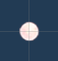

# Bullet

## Bullet 상속 구조

 

## 바로가기
### Connect Scene
 - [기본 총알](#기본-bullet)
 - [유저 총알](#유저-bullet)
 - [Boss Bomb](#보스-Bomb)

 

## [이전 창으로 돌아가기](https://github.com/shehdrbs123/Dongs-Portfolio/tree/main/UnityProject/NetworkShooting)

 

## 기본 Bullet

 |<H3><b>기본 bullet</b></H3>||
 |:---:|:---:|
 |||

## 구현 내용
- 적이 쓰는 기본적인 bullet입니다
- Weapon의 상속구조에 따라 CapsuleCollider2D.OnTriggerEnter()를 재구현
- GameObject의 tag를 확인하여 플레이어를 구분
- MoveObject.hitDamage() 데미지 전달 후 Network.Unspawn()을 수행

## [위로가기](#bullet)

 

## 유저 Bullet

 |<H3><b>Network Components 구조도</b></H3>|
 |:---:|
 ||

## 구현 내용
- 기본적인 구현 구조는 적 bullet과 같다
- 태그 확인 시 Enemy인지를 확인한다

## [위로가기](#bullet)

 

## 보스 Bomb

 |<H3><b>Network Components 구조도</b></H3>|
 |:---:|
 | |

## 구현 내용
- 보스 패턴 중 폭탄 발사 패턴에서 사용되는 bullet
- 코루틴을 사용해 일정 시간 후 제거, 파편을 생성해 발사하게 만듬
- 일정 시간 이후 NetworkServer.Unspawn()
- 보유하고 있는 파편 Prefabs를 Instatiate() 후 NetworkServer.Spawn() 됨

## [위로가기](#bullet)

 

## [이전 창으로 돌아가기](https://github.com/shehdrbs123/Dongs-Portfolio/tree/main/UnityProject/NetworkShooting)
