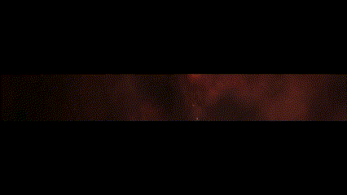
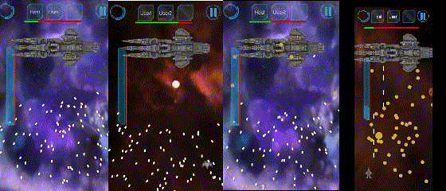

# Enemy
## 개요

|<H3><b>EnemyObject Class 상속 구조도</b></H3>|
|:---:|
||

다음은 EnemyObject의 상속 구조도 입니다. 
EnemyObject의 기본 모형에 맞추어 Boss, 추가기능을 하는 Slayer(적2)를 구현하였습니다.

## 바로가기

  - [Spawner](#spawner)
  - [적1](#적1)
  - [적2](#적2)
  - [Boss](#boss)

## [위로가기](#Enemy)

## [이전 창으로 돌아가기](https://github.com/shehdrbs123/Dongs-Portfolio/tree/main/UnityProject/NetworkShooting)

 

## Spawner

|<H3><b>Spanwer의 Enemy Spawn 모습</b></H3>|
|:---:|
||

## 구현 내용 
  - Game이 시작되면 TableSetter로부터 Spawner 자신이 생성 
  - 생성 시
    - Spawner의 Hierarchy에 등록된 적 오브젝트의 수 만큼 SpawnCoroutine을 생성/코루틴 실행
    - 보스가 생성되기 전 실행되는 delegate 메소드 TableSetter.singleton.DestroyWhenGaugeFull에 
        Spawner를 파괴하는 CmdDestroySpawner등록
  - 각 코루틴(적 기체 수 만큼)에서 정해진 대기 시간만큼(적 오브젝트별로 다름) 대기
  - 게임 상단 랜덤한 위치에서 적 오브젝트를 생성(NetworkServer.Spawn)
  - 적 오브젝트 Rigidbody2d.veloicity를 지정

## [위로가기](#Enemy)

 

## 적1

|<H3><b>적1의 이동과 shooting 모습</b></H3>|
|:---:|
||

- <H2>구현 내용 </H2>
 
  - 스폰 후 아래방향으로 일정속도로 전진 (Spawner에서 지정)
  - 일정 시간 마다 1개의 총알을 발사함.

 

- <H2>구현 세부 </H2>

  - y방향의 움직임은 Rigidbody.velocity의 변경, 마찰력없음으로 반영됨
  - Update 함수에서 쿨타임을 체크
  - 쿨타임보다 기다린시간이 크다면
  - bullet을 NetworkServer.Spawn을 통해 생성
  - bullet에 velocity를 부여하여 발사.

## [위로가기](#Enemy)
 

## 적2
|<H3><b>적2의 이동과 shooting 모습</b></H3>|
|:---:|
||

- <H2>구현 내용 </H2>
 
  - 스폰 후 아래방향으로 일정속도로 전진
  - 일정 시간 마다 발사 당시의 유저 방향으로 3개의 총알을 발사함.

- <H2>구현 세부 </H2>

  - y방향의 움직임은 Rigidbody.velocity의 변경, 마찰력없음으로 반영됨
  - Update 함수에서 쿨타임을 체크
  - 쿨타임보다 기다린시간이 크다면
  - bullet을 NetworkServer.Spawn을 통해 생성
  - bullet에 Player의 위치로 방향을 지정, 회전
    - Player의 위치는 Environment의 Boundary 참조
  - velocity를 부여하여 일정 간격으로 3발 발사.
    
## [위로가기](#Enemy)

 

## Boss
|<H3><b>보스의 등장과 패턴 모습</b></H3>|
|:---:|
||
||

- <H2>구현 내용 </H2>
 
  - 보스 체력바 데이터 동기화
  - 보스 4개의 공격 패턴 구현
- <H2>구현 세부 </H2>

  - 총알 구현
    - 기본 총알
      - 
      - 생성 시 방향과 속도를 입력 받아 진행
    - Bomb
      - 기본 총알을 상속
      - 일정 시간 이후 터지며 추가 총알을 생성
  - 공격패턴 구현
    - 한개의 코루틴 활용, 일정 시간마다 랜덤하게 패턴을 실행
    - 부채꼴 
      - 3곳의 발사위치에서 순서대로 부채꼴 형태의 총알을 발사
      - -45 + 10*j로 순서대로 각도 지정
      - 10발을 한번에 발사
    - 폭탄 발사 
      - 3곳의 발사위치를 랜덤하게 지정, 일정시간 후 터지는 Bomb 발사
      - -15 + Random.Range(0,30)로 각도 지정
      - 8발을 발사
      - 발사된 총알은 지정된 시간을 대기 후 파괴(코루틴 활용)
      - 파괴되며 다량의 파편 발사
    - 난사 
      - 3곳 중 랜덤한 위치에서에서 하위 45도 각도 내 랜덤으로 난사
      -  -45 + Random.Range(0,90)으로 총알 방향 지정
      - 3곳의 발사위치를 랜덤하게 지정
      - 0.02초 간격으로 반복(100번)
    - 모아쏘기
      - 발사 당시의 순간에 양쪽의 발사위치에서 유저방향으로 총을 여러번 발사
      - 유저위치로 총알 방향 지정
      - 양쪽 발사위치에서 동시에 여러발 발사(10번)
  - boss 체력 동기화
## [위로가기](#Enemy)
 

## [이전 창으로 돌아가기](https://github.com/shehdrbs123/Dongs-Portfolio/tree/main/UnityProject/NetworkShooting)